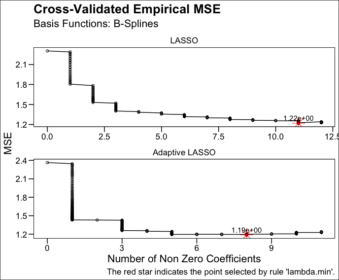

# dimada 

[](https://makeapullrequest.com)


> This package implements dimension adaptive estimation, which uses Sieves and Lasso-type methods to obtain an estimator with the property of adapting its convergence rate to the unknown dimension of underlying true model. Specifically, if the underlying model is parametric, this estimator converges as fast as a parametric estimator. If the underlying model is non-parametric, its convergence rate might be slower but it still converges whilst the usual parametric estimator does not converge at all. Hence, dimension adaptive estimator is weakly dominant in terms of approximation errors across different underlying models. The package 'dimada' allows users to easily perform such an estimator, together with other functions of plotting or summarizing the estimation results.

## Installation

You can install the development version of dimada from [GitHub](https://github.com/) with:
      
``` r
# install.packages("devtools")
devtools::install_github("ccfang2/dimada")
```

## Key Commands

The main command in this package is `dimada()`. Users are required to import response variable and a dataset of original independent variables. To construct sieves, users can choose from a variety of basis functions including power series, Legendre polynomials, B-splines and trigonometric polynomials, etc. Since a multivariate setup is considered, users also need to define the maximum number of interacting variables in a single term of sieves. If users already have the dataset of sieves, they could directly import the sieves instead of the original variables in this command. 

In terms of Lasso-type methods, users can choose from Lasso, [adaptive Lasso](https://www.tandfonline.com/doi/abs/10.1198/016214506000000735) and [twin adaptive Lasso](https://www.sciencedirect.com/science/article/abs/pii/S030440762100049X). Lasso is the basedline method, so it has to be included in the argument of `methods` in `dimada()`. An example of this command is given below.

```r
library(dimada)

# a data frame with 3 independent variables
set.seed(200)
df <- data.frame(a=runif(100), b=runif(100), c=runif(100))

# simulate a response variable with a non-parametric additive model and a normal error term
set.seed(200)
response2 <- sin(2*df[,1])+tan(df[,2])+log(df[,3])+rnorm(100,0.04)

# dimension adaptive estimation with B-splines and no interactions among variables
dimada2 <- dimada(y=response2, x=df, basis="bspline", max.interaction=1, methods=c("Lasso","adaLasso"))
```

To quickly plot out the main results of `dimada()`, one can use `dimada.plot()`. This command depicts the change of cross-validated approximation errors against lambdas used in Lasso-type methods or the consequent numbers of non zero coefficients. 

```r
(plot <- dimada.plot(dimada2,x="nzeros"))
```

The plot is as follows.

    

In particular, post-selection OLS model is performed after each Lasso-type method because the approximation error in Lasso-type methods also includes a regularization term which is always non-negative. Thus, it would be better to run a post-selection model without a regularization term so that the estimation result can be directly compared with other estimators. The results of Lasso-type methods and the post-selection OLS models can be quickly printed out with the command `dimada.summary()`.

```r
dimada.summary(dimada2,verbose=TRUE)
```

The summary is as follows.

```
======================================== 
          Sieve 
======================================== 
Basis function: B-Splines
Number of basis for each variable: 11
Maximum number of interactions in each term: 1
Time used: 0.1985888 secs
 
======================================== 
          LASSO
======================================== 
Selection rule of lambda: Value of lambda that gives minimum MSE
Selected lambda: 1.10e-01
Number of selected terms: 16
Cross-validated Empirical MSE: 1.29e+00
Time used: 0.09663105 secs
 
Coefficients: 
| c.bs1    -4.07724| 
| b.bs3    -0.30898| 
| c.bs3    -0.65680| 
| b.bs6     0.25717| 
| a.bs7     0.73617| 
| c.bs7     0.55403| 
| a.bs8     0.19316| 
| b.bs8     0.75094| 
| c.bs8     1.04857| 
| a.bs9     0.42152| 
| b.bs9     0.31796| 
| c.bs9     0.35445| 
| b.bs10    0.17608| 
| c.bs10    0.97992| 
| b.bs11    0.54156| 
| c.bs11    0.32007| 

======================================== 
          Post LASSO
======================================== 
Method: OLS on selected terms
In-sample MSE: 7.89e-01
 
Coefficients: 
|` c.bs1`   -4.88735| 
|` b.bs3`   -0.63130| 
|` c.bs3`   -1.17499| 
|` b.bs6`    0.59610| 
|` a.bs7`    0.80117| 
|` c.bs7`    0.45464| 
|` a.bs8`    0.24469| 
|` b.bs8`    1.21632| 
|` c.bs8`    1.35030| 
|` a.bs9`    0.73046| 
|` b.bs9`    0.46952| 
|` c.bs9`    0.30983| 
|` b.bs10`   0.54059| 
|` c.bs10`   0.88100| 
|` b.bs11`   1.21519| 
|` c.bs11`   1.09333| 

======================================== 
          Adaptive LASSO
======================================== 
Selection rule of lambda: Value of lambda that gives minimum MSE
Selected lambda: 5.72e-02
Number of selected terms: 13
Cross-validated Empirical MSE: 1.11e+00
Time used: 0.1827052 secs
 
Coefficients: 
| c.bs1    -4.74401| 
| b.bs3    -0.36603| 
| c.bs3    -0.95327| 
| b.bs6     0.28828| 
| a.bs7     0.99932| 
| c.bs7     0.45517| 
| b.bs8     1.07156| 
| c.bs8     1.52349| 
| a.bs9     0.70731| 
| b.bs9     0.39910| 
| c.bs10    1.35883| 
| b.bs11    1.12725| 
| c.bs11    0.35025| 

======================================== 
          Post Adaptive LASSO
======================================== 
Method: OLS on selected terms
In-sample MSE: 8.00e-01
 
Coefficients: 
|` c.bs1`   -4.84827| 
|` b.bs3`   -0.65782| 
|` c.bs3`   -1.11847| 
|` b.bs6`    0.56979| 
|` a.bs7`    0.98068| 
|` c.bs7`    0.39078| 
|` b.bs8`    1.13406| 
|` c.bs8`    1.58160| 
|` a.bs9`    0.86345| 
|` b.bs9`    0.69905| 
|` c.bs10`   1.14021| 
|` b.bs11`   1.41717| 
|` c.bs11`   1.03604| 
```

As is seen, the cross-validated (i.e., out-of-sample) MSEs for Lasso and adaptive Lasso are 1.29 and 1.11. However, this MSE includes the regularization term which is always non-negative. To remove such an impact, post-Lasso and post-adaptive Lasso are performed, and MSEs for both these post-selection methods are 0.789 and 0.8. Let's compare them to the MSE using parametric OLS estimator. The MSE from OLS `lm(response2~df[,1]+df[,2]+df[,3])` is 1.257. Hence, it is noted that in this non-parametric additive underlying model, our dimension adaptive estimator achieves a much smaller approximation error than parametric OLS estimator, less than 2/3 of it.

## Other Commands

In this package, there are also a series of functions that help to generate multivariate sieves from original dataset. Particularly, they consider the interactions among variables in the construction of sieves. These functions are suffixed with `.gen`, and the data frame in the output of these functions can be used as input of the argument `x.sieve` in command `dimada()`. Following is an example of generating sieves with power series by using `poly.gen()`.

```r
# a data frame with 3 variables and 100 observations
set.seed(200)
df <- data.frame(a=runif(100), b=runif(100), c=runif(100))
# sieves with power series, considering full interactions of these 3 variables
sieve1 <- poly.gen(data=df, test.data=NULL, n.basis=10, max.interaction=3, legendre=FALSE)
```

It is worthy of mentioning that users could also compute sieves for a test dataset, which can be used for evaluation of models estimated with sieves of the main dataset. 

## Note
- This package is a part of my [thesis](https://github.com/ccfang2/Masters_Thesis), which is supervised by Prof. Dr. Joachim Freyberger. The idea of constructing such a dimension adaptive estimator is from him. This is an ongoing project, and future improvement on this package is expected.
- The picture on the hexagon badge of this package is drawn with an [AI image creator](https://openai.com/dall-e-2) of Dall·E, OpenAI.

## Contact

Chencheng Fang, Email: [ccfang[at]uni-bonn.de](mailto:ccfang@uni-bonn.de),
Bonn Graduate School of Economics, University of Bonn, Germany

